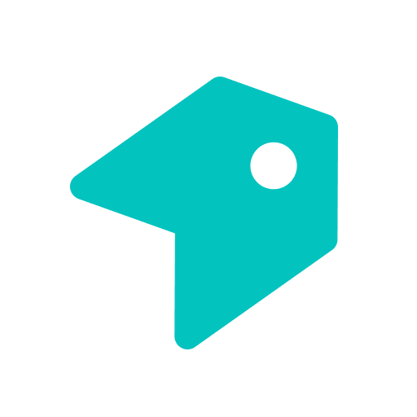

<div id="top"></div>

<br />
<div align="center">
   <a href="https://github.com/labelflow/labelflow/">
    
  </a>

  <h3 align="center">LabelFlow</h3>

  <p align="center">
    The open platform for image labeling
    <br />
    <a href="https://labelflow.ai/"><strong>Try it now »</strong></a>
    <br />
    <br />
    <a href="https://docs.labelflow.ai/">Explore docs</a>
    ·
    <a href="https://github.com/labelflow/labelflow/issues/new?assignees=&labels=bug&template=bug_report.md&title=">Report Bug</a>
    ·
    <a href="https://labelflow.canny.io/">Request Feature</a>
    ·
    <a href="https://discord.gg/sHtanUQA2V">Join the Community</a>
  </p>
</div>
<br />
<br />

## About


# Visual Data for absolutely everyone

LabelFlow is an open platform for image labeling. Its source is entirely available on this Github repository. You are in charge of your own data and workflows.

LabelBox, Roboflow, v7labs and other Image labeling tools are are awesome. They made our lives massively easier when we needed to label data. However, most tools are very limited in terms of control and customisations.

That's where LabelFlow.ai comes in. Self-hosted or hosted by us. White-label by design. API-driven and ready to be deployed on your own domain. Full control over your images and labels.

[Labelflow.ai](https://labelflow.ai) is the parent company developing LabelFlow, and commercializing a Hosted version.

You can build LabelFlow from source, and serve it from your machine. Read how to [deploy it yourself](#running-labelflow-on-your-machine).

### Built With

- [TypeScript](https://www.typescriptlang.org/): Main programming language of the web app
- [ReactJS](https://reactjs.org/): View library of the web app
- [NextJS](https://nextjs.org/): Web framework of the web app
- [GraphQL](https://graphql.org/): API, communication between client and server
- [NodeJS](https://nodejs.org/en/): Javascript runtime for development and production on docker
- [Python](https://www.python.org/) for the machine learning server
- [PyTorch](https://pytorch.org/) for the machine learning server

### Stay Up-to-Date

LabelFlow officially launched as v.0.1 on 7th of September, however a lot of new features are coming. Watch releases of this repository to be notified for future updates:


<p align="right">(<a href="#top">back to top</a>)</p>

## Getting Started

### LabelFlow.ai hosted version

You can use our hosted version now for free, at [labeflow.ai](https://labelflow.ai).

### Serving your own LabelFlow

This guide walks you through the steps needed to run a production-ready version of LabelFlow locally.

Before continuing, please have a look at our <a href="./LICENSE">License</a> ⬅️.

#### Prerequisites

You need to have below listed softwares installed on your machine to run labelflow.

- ✔️ Git 📦
- ✔️ Node (v15.5.0 or above) 📦
- ✔️ Yarn (v1.22.4 or above) 📦

#### Running LabelFlow on your machine

1. Clone the repository on your machine using

   ```shell
   git clone https://github.com/labelflow/labelflow.git
   ```

2. Go into the labelflow folder

   ```shell
   cd labelflow
   ```

3. Install dependencies using yarn

   ```shell
   yarn install
   ```

4. Build the web app

   ```shell
   yarn build:web
   ```

5. Start the web server

   ```shell
   yarn start:web
   ```

6. Open your browser and visit [http://localhost:3000](http://localhost:3000).

#### A note on environment variables

You can find the full list of environment variables needed for a fully featured app in the [`.env.development`](https://github.com/labelflow/labelflow/blob/feature/workspaces/.env.development) file. As you can see this file contains variables that are secrets and that should not be committed to your repo. In order to still be able to have secrets you should create:

- an `.env.local` file at the root of the repo and make a copy of it inside the folders `typescript/db`, `typescript/infrastructure` and `typescript/db`. We recommend doing symlinks between the files to avoid having to copy/paste again each file when modifying it

- an `.env.production` file that will be a copy of `.env.development` but with the env var values set to the production ones. This file won't be committed either so you can safely store your secrets here

<p align="right">(<a href="#top">back to top</a>)</p>

## Roadmap

- The short term roadmap is on Github https://github.com/orgs/labelflow/projects/5
- The longer term feature roadmap is on Canny https://labelflow.canny.io/

<p align="right">(<a href="#top">back to top</a>)</p>

## License

LabelFlow sources are entirely available on Github, and LabelFlow is primarily distributed under the terms of the Business Source License (BSL), like our friends at [MariaDB](https://mariadb.com/bsl11/), [Sentry](https://blog.sentry.io/2019/11/06/relicensing-sentry) and [CockroachDB](https://www.cockroachlabs.com/blog/oss-relicensing-cockroachdb/).

As they explain very well, the BSL is the closest thing to open source that we can do without being threatened by external companies. LabelFlow source is available on this repository, you can deploy LabelFlow entirely on premises, and you can contribute to LabelFlow here!

See [LICENSE](https://github.com/labelflow/labelflow/blob/main/LICENSE) for details.

<p align="right">(<a href="#top">back to top</a>)</p>

## Contact

- Discord Community https://discord.gg/sHtanUQA2V
- Website https://labelflow.ai/website
- Twitter https://twitter.com/labelflowai
- LinkedIn https://www.linkedin.com/company/labelflow/
- Facebook https://facebook.com/labelflow-102033695440701

<p align="right">(<a href="#top">back to top</a>)</p>
